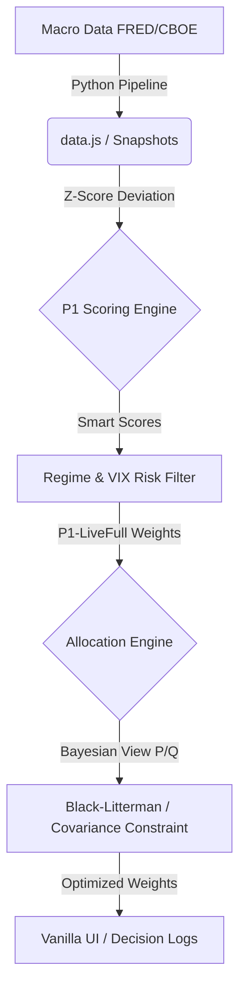

# Lumi 2.0: Global Asset Allocation Decision Copilot / 全球资产配置宏观决策系统

[](https://opensource.org/licenses/MIT)
[](https://www.python.org/)
[](https://developer.mozilla.org/en-US/docs/Web/JavaScript)
[](#)

**Lumi 2.0** is an industrial-grade, macro-driven global asset allocation decision-support engine (your investment copilot). It empowers investors to eliminate emotional bias and generate highly robust, risk-adjusted quarterly asset weight recommendations based on objective quantitative models.

**Lumi 2.0** 是一款工业级的宏观基本面驱动全球资产配置决策系统（您的投资副驾驶）。它通过科学的数据量化与客观的执行纪律，帮助投资者排除主观情绪干扰，生成具备高抗风险能力的季度大类资产推荐比例。

---

## 📈 Long-Term Performance Showcase / 长期实操业绩展示

Verified by a rigorous **25-year long-cycle historical backtest** (2000-Q1 to 2025-Q4) covering major global asset classes:
通过覆盖全球核心大类资产的 **25年超长周期历史回测**（2000-Q1 至 2025-Q4）深度验证：

| Metric / 指标 | P1 Pure Engine / P1 纯打分 | **P1-LiveFull (Standard) / 实操基准** | 60/40 Baseline / 60/40基准 |
|:---|:---:|:---:|:---:|
| **CAGR / 年化复利** | **14.71%** | **12.96%** | 10.21% |
| **Sharpe / 夏普比率** | **0.682** | **0.626** | 0.509 |
| **Excess Return / 超额收益** | **+4.50pp** | **+2.75pp** | Base / 基准 |

> 💡 **5-Year Rolling Window Validation / 近5年滚动窗口验证 (2021 ~ 2025)**: 
> The system has successfully completed rolling window stress tests. Amidst the highly volatile markets of the past five years, it achieved an average annual return of **10.04%**, proving the robust risk-mitigation capability of our scoring and turnover stabilization algorithms without overfitting.
> 
> 系统已通过严苛的滚动窗口压力测试。在近五年极具挑战性的高波动市场中，录得平均 **10.04%** 的稳健年化回报，证实了评分机制与稳定器极强的鲁棒性与无过拟合特征。

---

## ⚙️ Core Architecture / 核心系统架构

Lumi utilizes a **"Data Pipeline + Dual-Engine"** closed-loop decision architecture:
Lumi 采用**“自动化数据管线 + 双决策引擎”**的闭环架构：

1. **Scoring Engine (P1) / P1 评分引擎**
   - Extracts 8 core macroeconomic factors (inflation, real yield, liquidity, etc.) via a Python data pipeline.
   - Computes dynamic Z-Score deviations and maps them to "attractiveness scores" (0-100) across 18 global asset classes.
   - 自动拉取增长、通胀、流动性等 8 个宏观因子，计算 Z-Score 偏离度，精准输出 18 类全球资产的吸引力评分。

2. **Wind-Control Allocation Engine (Black-Litterman) / BL 风控配置引擎**
   - Starts with global market equilibrium and overlays P1 scores as Bayesian views.
   - Constrains assets using a 60-month ETF covariance matrix to prevent "fake diversification" and correlation concentration risks.
   - 以全球市值均衡为起点，将 P1 评分转化为贝叶斯观点，通过 60 个月 ETF 真实协方差矩阵对资产进行联动约束，防范伪分散与相关性集中风险。



---

## 🚀 Key Highlights in v2.0 / v2.0 核心功能与亮点

- **D3 Multi-Step Predictor / D3 宏观多步预测**
  Integrates a forecasting pipeline that predicts next-quarter macroeconomic directions based on structural inertia, guiding strategic positioning.
  引入 D3 预测管线，基于宏观结构惯性预测下季度多因子走向，提供高置信度的战略仓位方向指引。

- **Turnover Stabilizer (Anti-Shake) / 换手稳定器 (防抖)**
  Features a built-in anti-shake smoothing algorithm that slashes transaction costs and taxable events by avoiding unnecessary rebalancing during minor macro fluctuations.
  内置防抖平滑算法，在微小的宏观波动下自动抑制过度调仓，大幅降低实盘摩擦交易成本与税务损耗。

- **"Growth Candidate" Regime / “增长候选”高风险模式**
  In addition to the standard Balanced profile, we introduced a concentrated-capped regime, offering aggressive capital growth options while maintaining solid risk-control boundaries.
  在默认平衡稳健模式之外，新增“增长候选（集中上限）”特化高收益模式，满足不同资金属性的多档配置诉求。

- **UI & Module Consolidation / 前端控制流大合并**
  Consolidated redundant template loading paths to unify interactive entries, ensuring flawless dashboard rendering and robust backtest performance.
  全面整合冗余模板代码，消除加载冲突，确保回测、增长模式和 BL 诊断详情面板的绝对运行鲁棒性。

---

## 🛠️ Quick Start / 快速开始

### Prerequisite / 运行要求
- A modern web browser / 任意现代浏览器（Chrome / Edge / Safari）
- Python 3.8+ (Only for running optional automated data updates / 仅用于自动数据更新脚本)

### Local Launch / 本地运行
1. **Clone the repository / 克隆项目到本地**:
   ```bash
   git clone https://github.com/neoxuye/assets-management.git
   cd assets-management
   ```
2. **Launch the Interface / 打开前端**:
   - Simply double-click **`index.html`** to run Lumi 2.0 locally! No server-side installation or server deployment required.
   - 直接双击 **`index.html`** 即可在浏览器本地运行系统！极致轻量，零服务器端依赖。

3. **(Optional) Automated Data Pull / (可选) 自动更新宏观数据**:
   ```bash
   pip install yfinance pandas requests
   python scripts/update_snapshots.py
   python scripts/d3_macro_predictor.py
   ```

---

## 📁 Repository Structure / 目录结构

```
assets-management/
├── index.html                  # Main UI Entry / 系统交互主入口
├── js/
│   ├── algo_v16.19.js          # Scoring engine core algorithm / P1 评分核心算法
│   ├── core_v16.18.js          # Allocation & stabilizer logic / 配置与稳定器逻辑
│   ├── walk_forward.js         # Walk-forward backtest core / WF 滚动回测引擎
│   ├── bl_engine.js            # Black-Litterman framework / 贝叶斯相关性约束引擎
│   └── data.js                 # Macro snapshots database / 宏观历史快照底盘
├── scripts/
│   ├── d3_macro_predictor.py   # D3 predictive engine / D3 宏观趋势预测脚本
│   └── update_snapshots.py     # Automated FRED data pipeline / FRED 自动拉取数据
└── docs/                       # Project Documentation / 系统核心文档库
    ├── README.md               # Doc directory index / 文档中心索引
    └── 运营手册.md              # Operation SOP & Manual (v2.0) / 季度运营手册 (v2.0)
```

---

## ⚖️ License / 开源协议

This project is licensed under the **MIT License**. Feel free to use, modify, and distribute for personal or commercial use.
本项目采用 **MIT 开源协议**。欢迎自由学习、修改和用于个人或商业配置决策。
